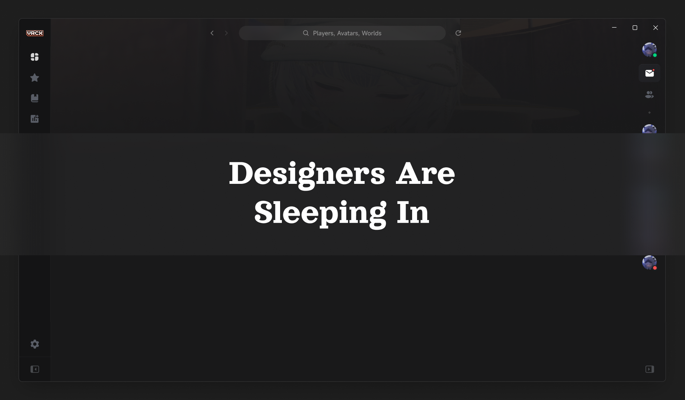

# VRCX-Next



**Please note: This project is in a very early development stage and is almost completely unusable at this time.**

VRCX-Next is a complete rewrite of the popular VRCX project. This new version aims to overhaul the entire application from the ground up, focusing on a complete reset of the architecture, UI design, and interaction logic.

The goal of this project is to create a more stable, modern, and user-friendly experience for everyone. We've taken everything we learned from the original VRCX and are rebuilding it with a fresh perspective and a forward-thinking approach.

We're currently using the name VRCX-Next to denote this project's status as the successor to VRCX. However, we're open to renaming the project in the future to better reflect its new identity. For now, we plan to stick with the name VRCX-Next.

Thank you for your interest and support. We're excited to show you what we've been working on!

## Project Setup

### Install

```bash
$ npm install
```

### Development

```bash
$ npm run dev
```

### Build

```bash
# For windows
$ npm run build:win

# For macOS
$ npm run build:mac

# For Linux
$ npm run build:linux
```
